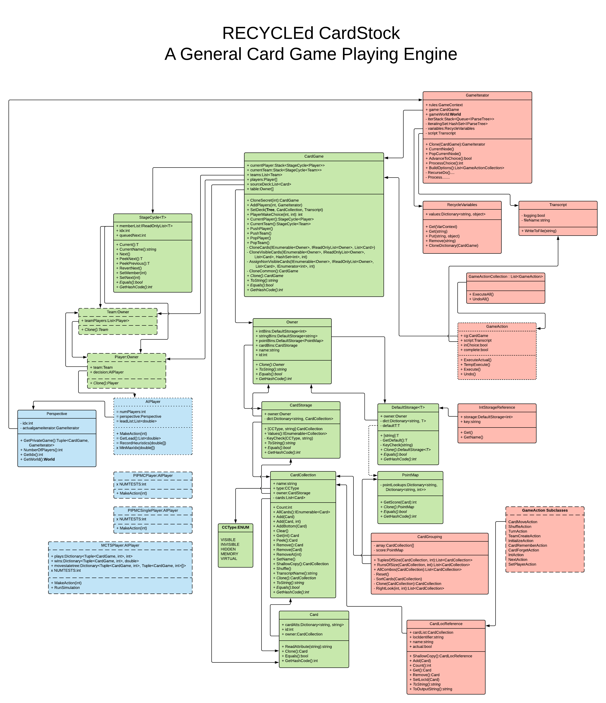

# RECYCLEd CardStock V2.0

## Project Goals

CardStock is a General Game Playing engine for card games implemented 
in C#. Games are written in RECYCLE, a card game description language, and
then simulations are run with random, simple, and complex AI players. CardStock can then
analyze the games to determine heuristics about the games
such as fairness, decisiveness, drama, or clarity, and generate transcripts of
each simulation for further study.

We are currently in the process of abstracting and refactoring CardStock to allow
for new game functionality and setting up a modular system for a
tournament of AI players. Please check back for further progress on these issues.

## Games

There are currently 52 games coded in RECYCLE

* Adding
    * [Caterpillar](http://www.parlettgames.uk/oricards/caterpil.html) (2p)
    * [Cribbage](https://www.pagat.com/adders/crib6.html) (2p)
    * [Ninety Eight](https://www.pagat.com/adders/98.html) (4p)
* Catch and Collect
    * Enchère (3p)
    * [GOPS](https://www.pagat.com/misc/gops.html) (2p)
    * [Go Fish](https://www.pagat.com/quartet/gofish.html) (4p)
    * [Turn the Tide](https://gamewright.com/pdfs/Rules/TurnTheTide-RULES.pdf) (3p)
* Draw and Discard
    * [Golf Six](https://www.pagat.com/draw/golf.html) (2-4p)
    * [Lost Cities](https://cdn.1j1ju.com/medias/c8/66/47-lost-cities-rulebook.pdf) (2p)
    * [Spite and Malice](https://www.pagat.com/patience/spitemal.html) (2p)
* Exchange
    * [Cuckoo](https://www.pagat.com/cuckoo/cuckoo.html) (6p)
    * [Schwimmen](https://www.pagat.com/commerce/schwimmen.html) (5p)
* Fishing
    * [Scopa](https://www.pagat.com/fishing/scopa.html) (2p)
    * [Stealing Bundles](https://www.pagat.com/fishing/bundle.html) (2-4p)
* Poker
    * [Kuhn Poker](https://en.wikipedia.org/wiki/Kuhn_poker) (2p)
    * [Leduc Poker](https://pettingzoo.farama.org/environments/classic/leduc_holdem/) (2p)
* Press Your Luck
    * [BlackJack](https://www.pagat.com/banking/blackjack.html) (2p)
    * [Pairs](https://cheapass.com/wp-content/uploads/2018/02/PairsCompanionBookWebFeb2018.pdf) (2-5p)
        * Continuous Pairs (4p)
        * Calamity Continuous Pairs (4p)
* Shedding
    * [Comet](http://www.catsatcards.com/Games/Comet.html) (2p)
    * [Crazy Eights](https://www.pagat.com/eights/crazy8s.html) (4p)
        * Sane Eights (4p)
    * [Simon's Cat](https://www.sjgames.com/simonscat/Simons-Cat-Rules.pdf) (4p)
* Trick Taking
    * Avoidance
        * [Hearts](https://www.pagat.com/reverse/hearts.html) (3-5p)
           * Omnibus Hearts (4p)
           * Broken Hearts (4p)
           * Pure Hearts (4p)
           * Grey Lady (4p)
           * Black Maria (4p)
           * Spot Hearts (4p)
        * [Knaves](http://whiteknucklecards.com/games/knaves.html) (3-4p)
        * [Polignac](http://whiteknucklecards.com/games/polignac.html) (4p)
        * [Slobberhannes](http://whiteknucklecards.com/games/slobberhannes.html) (4p)
    * All Fours
        * [California Jack](https://www.bicyclecards.com/how-to-play/california-jack/) (2p)
        * [Pitch](https://www.pagat.com/allfours/pitch.html#players) (4p)
        * [Shasta Sam](https://www.bicyclecards.com/how-to-play/shasta-sam/) (4p)
    * Others
       * [Agram](https://www.pagat.com/last/agram.html) (2-5p)
       * [Duck Soup](http://www.parlettgames.uk/oricards/ducksoup.html) (2p)
       * [Euchre](https://www.pagat.com/euchre/euchre.html) (4p)
       * [German Whist](https://www.pagat.com/whist/german_whist.html) (2p)
       * [Sheepshead](https://www.pagat.com/schafkopf/shep.html) (5p)
           * Cheesheads (5p)
       * [Skittgube](https://www.pagat.com/beating/skitgubbe.html) (3p)
       * [Spades](https://www.pagat.com/auctionwhist/spades.html) (4p)
       * [Sueca](https://www.pagat.com/aceten/sueca.html) (4p)
       * [The Bottle Imp](https://tesera.ru/images/items/11335/Bottle_Imp_Rules_EN.pdf) (3-4p)
       * [Whist](https://www.pagat.com/whist/whist.html) (4p)
* Unique
    * [Coloretto](https://www.riograndegames.com/wp-content/uploads/2013/02/Coloretto-Rules.pdf) (4p)
    * [Coup](http://boardgame.bg/coup%20rules%20pdf.pdf) (4p)
    * [LAMA](https://boardgamegeek.com/filepage/180052/lama-official-rules) (2-6p)
    * [No Thanks](https://world-of-board-games.com.sg/docs/No-Thanks.pdf) (3-5p)

## Requirements

* [Visual Studio Code](https://code.visualstudio.com/)
* [.NET Core v 9.0](https://dotnet.microsoft.com/en-us/download/dotnet/9.0)
* [C# Dev Kit Extension](https://marketplace.visualstudio.com/items/?itemName=ms-dotnettools.csdevkit)
* [ANTLR4 grammar syntax support](https://marketplace.visualstudio.com/items/?itemName=mike-lischke.vscode-antlr4)

## Setup

1. Open `CardStock` folder in the project using Visual Studio Code.
2. Install .NET Install Tool Extension
3. Get .Net Core 9.0
4. Install C# Dev Kit Extension
5. Open the CardStock subdirectory
6. Write up your game in RECYCLE in the `games` subdirectory.
7. Alter the `Program.cs` class to specify the name of your game.
8. Run the program in either Release or Debug mode.
9. For Release mode, in the terminal type "dotnet run --configuration Release"
10. Choose "Release Mode" to only see the results, or "Debug Mode" to see all game actions (better logs in the future).

## References

* [The Shape of Card Games Blog](http://mgoadric.github.io/cardstock)
* [ReadTheDocs.io](http://cardstock.readthedocs.io)
* [Automated Playtesting with RECYCLEd CardStock](http://mark.goadrich.com/articles/issue-2-1-09-recycled.pdf), Connor Bell and Mark Goadrich, *Game & Puzzle Design Journal*, Vol 2, Issue 1, July 2016
* [Quantifying the Space of Hearts Variants](http://mark.goadrich.com/articles/Hearts_ACS_2021.pdf), Mark Goadrich and Collin Shaddox, *Advances in Computer Games 2021*, November 2021
